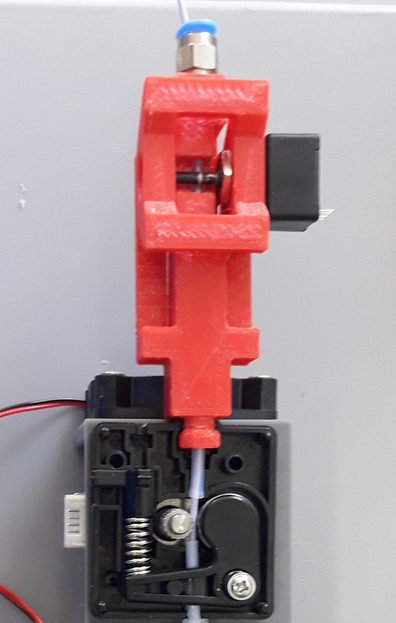

.. raw:: html

   <link rel="stylesheet" href="/images/js_css/asciinema-player.css"" type="text/css"/>

ddPrint - Adding Process control to FDM printers
=================================================

:tags: FDM, 3DDruck, 3dprinting, python, ddprint
:slug: ddprint-3d-printer-firmware

.. image:: /images/um2-1/20200421_212447.jpg
   :width: 75px
   :target: /images/um2-1/20200421_212447.jpg

.. image:: /images/flowsensor_red.jpg
   :width: 150px
   :target: /images/flowsensor_red.jpg

**Note: Experimental and work in progress, documentation is incomplete and outdated.**

Overview
++++++++++

..
   XXX LEVEL 1 XXX

DDPrint adds process control to FDM printer.

The process that is to be controlled is the process of extruding plastic.

This includes the feeder, a bowden tube (*) and the hotend with its heater, lets call
this the *extruder*.

Most FDM printers have no feedback on the extruder part of the printer - they are running *open loop*.

That means to find the balance of printing speed (better: volumetric flow) and hotend temperature
is difficult. Another problem of this *open loop* extrusion system is that the printer cannot react when the
hotend has difficulties to deliver the current demand of flow (for example when printing the first layer or when
the hotend is not hot enough yet).

To close the control loop we add a `sensor <#flowratesensor>`__ to measure the performance of the extruder
und use this data to control the temperature of the hotend and the speed of the printer.

The control loop is closed in two ways, an acvitve way where the speed of the printer is lowered if the hotend cannot 
deliver the demanded flowrate and the feeder begins to slip.
The other is a *feed forward* way: The flowrate sensor is used to measure the characteristics of a given filament - extruder
combination. The result of this measurement is a so called `material profile <#material-profiles>`__.

Control of hotend temperature is called `autotemp <#auto-temp>`__.

Control of printer speed is done with the `temperature-limiter <#temperature-limiter>`__ and the `flowrate-limiter <#flowrate-limiter>`__
.

(*) For the moment `bowden style printers only. <#bowden-style-printers-only>`__

.. contents::

..
   XXX LEVEL 2 XXX

Flowratesensor
++++++++++++++

.. image:: /images/ender5/flowrate_sensor_ender5_assembled.jpg
   :width: 100px
   :target: /images/ender5/flowrate_sensor_ender5_assembled.jpg

.. image:: /images/ender5/20210814_123443.jpg
   :width: 100px
   :target: /images/ender5/20210814_123443.jpg

.. image:: /images/flowratesensor/flowsensor1.jpg
   :width: 65
   :target: /images/flowratesensor/flowsensor1.jpg

.. image:: /images/ender5/flowrate_sensor_ender5.jpg
   :width: 100px
   :target: /images/ender5/flowrate_sensor_ender5.jpg

The flowrate sensor (FRS) is used to measure the movement of the filament. It consists of a incremental rotary encoder (Bourns EMS22) and a 3d printed housing.
The axle of the encoder is pressed onto the moving filament using a spring that is part of the FRS housing.

The distance-information from the FRS is continuously read by the firmware and is used for several tasks:

* Compute the speed of the filament and the resulting volumetric flowrate (taking filament diameter into account).
* Compare the actual volumetric flow with the nominal volumetric flow to implement the `flowrate-limiter <#flowrate-limiter>`__.
* Automatically record `material profiles <#material-profiles>`__.
* Automatically `calibrate the feeder "esteps" <#calibrateesteps>`__ (for the machine profile).
* Automatically `calibrate the FRS <#calibratefilsensor>`__ (for the machine profile, too).

More details `are here <#flowratesensor-1>`__.

Bowden style printers only?
+++++++++++++++++++++++++++

For best results, the flowrate sensor has to be placed *after* the feeder. This is easy for a bowden style printer.

For direct driver printers it should be possible but it is more difficult to add the flowrate sensor into the print head (because of
space requirements, heat, added weight and so on).

Material Profiles
+++++++++++++++++

Material (filament) profiles are used for two things in ddprint:

* They define the hotend temperature necessary to melt a given volumetric flow of filament, see `autotemp feature <#auto-temp>`__.
* The `temperature-limiter <#temperature-limiter>`__ uses the information in the material profile to slow down the print in cases
  where the hotend is not hot enough (yet) to melt the requestet amount of filament.

With other words: the material profile gives a picture of the hotend melting capacity for a given machine/filament combination - "*the printer knows its filament*".

A material profile for a given filament is created automatically by ddPrint and stored in JSON format for later use.

This filament-measurement is done in two steps:

* A best-case scenario where filament is extruded *into air*.
* And a worst-case scenario where a small testpart is printed under difficult circumstances (high backpressure because of 100% infill and small layerheight).

ddPrint comes with a python script to plot material profiles (plot_mat_profile). Here are two examples of material profiles, one
for a PLA filament and one for a PETg filament:

.. image:: /images/mat-profile/Mat._Profile_esun_pla_glass-purple.json.png
   :width: 250px
   :target: /images/mat-profile/Mat._Profile_esun_pla_glass-purple.json.png

.. image:: /images/mat-profile/Mat._Profile_herz_petg-black-5800070.json.png
   :width: 250px
   :target: /images/mat-profile/Mat._Profile_herz_petg-black-5800070.json.png

For more details `see here <#material-profiles-1>`__.

Auto Temp
+++++++++++++

While parsing/pathplanning the gcode input, the needed volumetric flowrate is computed. Then the required (minimum) temperature
for this flowrate is determined using a (automatically measured) `material profile <#material-profiles>`__ of the used filament.

So when printing, the temperature of the hotend is dynamically changed in respect to the currently requested flowrate.
This is done in a feed-forward manner because there is a delay between controlling the hotend heater and the change of
temperature in the melting zone/nozzle, of course.

:Note: because of this automatic temperature control, ddPrint ignores bed- and hotend-temperature related commands (M104, M140...) in the gcode input file. When slicing
       your models to be printed with ddPrint you can forget about all the temperature settings there.

The hotend temperature follows the volumentric flow demand given in the input gcode file, is increased for parts of the model where high
flow rates are required and vice-versa.

Temperature limiter
++++++++++++++++++++

The firmware part of ddPrint running on the printer maintains a *temperature-flowrate* table. This table is downloaded from the host to the firmware before
a print is done.

The *temperature-flowrate table* maps hotend temperatures to the max. volumetric flowrates (extruder speed) allowed at a given temperature (for the used
filament). This table is generated from the information found in the material-profile of the used filament (see `material profile <#material-profiles>`__) by the host
part of ddPrint.

If the current hotend temperature is too low for the requested extrusion speed, the speed of the printer (feedrate) is scaled down so that it matches
the achievable flowrate value in the table. This avoids underextrusion (thogether with filament-grinding) and the many problemns related to it.

This is called *temperature limiting*. The temperature-limiter works on a per-printing-move basis, that means this check and a possible slowdown is done
for every straight line of the printhead (essentially for every printing gcode line).

With other words: The *temperature-limiter* together with the `autotemp <#auto-temp>`__ feature ensures that the hotend is always hot enough to
be able to melt the requeste amount of filament.

Flowrate limiter
++++++++++++++++

Similar to the `temperature-limiter <#temperature-limiter>`__ the *flowrate-limiter* slows down the print to avoid underextrusion and grinding of the filament.

It starts to limit the feedrate when the feeder slip is above some threshold, so it uses the *grip value* measured by the `volumetric flowrate sensor <#flowratesensor>`__ (FRS).

Up to 10% of feeder slippage (90% grip) is allowed before the firmware begins to slow down the print. Below 90% grip the feedrate is decreased linearly until reaches
one quater (25%) of the nominal speed, see following plot.

.. image:: /images/ddprint/flowrate-limiter-plot.png
   :width: 150px
   :target: /images/ddprint/flowrate-limiter-plot.png

..
   XXX LEVEL 3 XXX

More in detail
++++++++++++++

Flowratesensor
--------------

.. image:: /images/ender5/flowrate_sensor_ender5_assembled.jpg
   :width: 100px
   :target: /images/ender5/flowrate_sensor_ender5_assembled.jpg

.. image:: /images/ender5/20210814_123443.jpg
   :width: 100px
   :target: /images/ender5/20210814_123443.jpg

.. image:: /stl/feedsensor_v2_preview_cutopen.png
   :width: 185px
   :target: /stl/feedsensor_v2_preview_cutopen.png

The FRS consists of the following components:

* A 3d printed housing (PETg).
* The incremental rotary encoder (EMS22).
* A ptfe inliner with a small cutout to allow the encoder axle to touch the filament.
* A pneumatic coupler to connect the extruder bowden tube to the FRS.
* Depending on the type of the feeder a short piece of a M6 heatbreak to mount the FRS
  at the feeder outlet.
* A cable to connect the FRS to the mainboard of the printer (SPI bus).

The EMS22 rotary encoder has a resolution of 1024 counts per revolution. The diameter of the axle is 3.17mm, this equates
to a overall resolution of about 10µm (0.0097mm) of filament movement per count.

The nominal accuracy of the sensor is 0.7° (about 0.2%), worst case accuracy is 1.4° (about 0.4%). You can find a copy of the EMS22
datasheet (PDF) `here </doc/datasheets/EMS22A.pdf>`__.

The firmware reads the rotary encoder every 10mS, meaning a sample rate of 100Hz.

.. image:: /images/ender5/flowrate_sensor_ender5_with_feeder.jpg
   :width: 100px
   :target: /images/ender5/flowrate_sensor_ender5_with_feeder.jpg

The FRS is mounted at the feeder outlet with an adapter that is part of the FRS housing (BMG or UM2 feeder) or with
a short piece of a M6 heatbreak (Anycubic or Ender feeder) (todo: add bmg style picture).

`Here are some STL files <https://github.com/ErwinRieger/ddprint/tree/master/stl>`__ of the FRS housing.

Material Profiles
-----------------

TBD. (describe filament measurement and plotted graphs, workingpoint setting)

---------------------------------------------------------------------------------------------

** Following stuff has to be reviewed **

FDM 3d printer firmware with host preprocessing and *closed loop E*
++++++++++++++++++++++++++++++++++++++++++++++++++++++++++++++++++++++

See last chapter in this document for a log/history.

.. image:: /images/flowsensor_red.jpg
   :width: 200px
   :target: /images/flowsensor_red.jpg

3d printer firmware for cartesian FDM printers (ultimaker clones, atmega and stm32, like um2, ramps or jennyprinter).

This firmware is part of the *ddprint printing system*, which immproves a common FDM printer by a closed loop E-Axis: http://www.ibrieger.de/close_the_loop_for_e.html.

Reference printer is a Ultimaker 2 with ddprint installed and some hardware
modifications: http://www.ibrieger.de/pimped-ultimaker-2.html, and a jennyprinter X340 now too.

Github Mirror, project Homepage
++++++++++++++++++++++++++++++++

DDPrint FDM firmware: `github.com/ErwinRieger/ddprint <http://github.com/ErwinRieger/ddprint>`__, mirrored here: http://www.ibrieger.de/ddprint-3d-printer-firmware.html.

DDprint system project homepage: `ibrieger.de/close_the_loop_for_e.html <http://www.ibrieger.de/close_the_loop_for_e.html>`__.

Video: https://youtu.be/1Kbl9AZd10Y, ddprint playlist: https://www.youtube.com/playlist?list=PLzn7lnnZpS7XP-JhLw_o7p27ayv5bJ29o.

HackadayIO project: https://hackaday.io/project/170695-ddprint.

Current state
+++++++++++++++++++++++++++++++

Works for me.

Key features
+++++++++++++

* Uses a incremental sensor to measure extruder flowrate at realtime
  to "close the loop for E". This limits the speed of the printer
  if feeder tends to slip.
* Automatic measurement of feeder system caracteristics for calibration.
* Automatic measurement of filament caracteristics to create filament
  profiles .
* "Auto temperature algorithm": hotend temperature depends on the
  gcode-requested flowrate. 
* "Temperature-flowrate-limiter": speed of printer is limited if hotend
  has not (yet) the right temperature for the requested flowrate.
* Extruder pressure advance, of course ;-)

Main part is the `Flowrate Sensor <#flowratesensor>`__ realized with a Bourns EMS22AFS incremental
encoder.

Installation
+++++++++++++

Firmware part
-------------

Requirements
************

* Arduino code/libraries and avr compiler
* Arduino-Makefile
* SdCard library
* Protothreads header

Install them along the checked out ddprint sources so that the
directory structure looks like this:

.. code-block:: sh

    .
    ├── ddprint
    │   ├── LICENSE
    │   ...
    ├── arduino-1.6.13
    │   ├── arduino
    │   ...
    ├── Arduino-Makefile
    │   ├── Arduino.mk
    │   ...
    ├── protothreads-cpp
    │   ├── LICENSE.txt
    │   ...

The following versions are used at the moment (maybe newer versions will also work):

.. code-block:: sh

    Arduino IDE 1.6.13, installed from downloaded archive.

    Arduino-Makefile from https://github.com/sudar/Arduino-Makefile.git
        commit c3fe5dcc2fbd5c895b032ca5a5a1f60af163b744
        Merge: 7a26a86 6d3d973
        Author: Simon John <git@the-jedi.co.uk>
        Date:   Thu Dec 28 18:05:18 2017 +0000

    Protothreads from https://github.com/benhoyt/protothreads-cpp.git
        commit 984aa540dd4325b7e23dc76135ca28a36526f0c6
        Author: Ben Hoyt <benhoyt@gmail.com>
        Date:   Tue Dec 4 16:48:52 2018 -0500

        Apply ddprint/patches/protothreads-cpp.patch

Build and upload firmware
***************************

:Note: keep a backup of your previous firmware in case you want to go back.
:Note: ddPrint does not use EEProm.

For a ultimaker UM2 do:

.. code-block:: sh

    make -f Makefile.fw
    make -f Makefile.fw do_upload

For a ramps based printer do:

.. code-block:: sh

    make -f Makefile.ramps
    make -f Makefile.ramps do_upload

:Todo: Add info about configuration.

Host part
-------------

Requirements:

* apt-get install python python-serial
* pip install npyscreen vor the TUI (ddprintui.py)

No installation procedure yet, checkout the repository and run *ddprint.py* or *ddprintui.py* from the
*ddprint/host* subdirectory.

Configuration
+++++++++++++

Parts of printer configuration hardcoded in firmware, parts come from printer profile at runtime.

:Todo: describe configuration.

Only one setting stored in printer: the printer name.

:Todo: describe printer name setting.

Gcode input
+++++++++++++

Easier slicing, simple gcode
-----------------------------

:Note: Simplify3d is used as of this writing.

Use mostly plain gcode with ddprint, many of the *advanced features* of the slicers (like coasting or acceleration control) are not
needed, see http://www.ibrieger.de/close_the_loop_for_e.html#simpler-gcode.

The (automatically measured) material profile gives a picture of the hotend melting capacity for a given machine/filament combination.
This eases the determination of a good printing speed. 

Simplify3d example slicer settings in https://github.com/ErwinRieger/ddprint/tree/master/examples/s3d_profiles.

Supported gcodes
-----------------

*Todo*

Usage, Commandline Interface
++++++++++++++++++++++++++++++++++

Machine setup and calibration
------------------------------

*setPrinterName*
**************************************

Store printer name in printer's runtime config (on mass storage device):

.. code-block:: sh

    ./ddprint.py setPrinterName UM2-1

See also: `getprintername command <#read-printer-name-from-printer-getprintername>`__.

*getEndstops*
**************************************

Get current endstop state.

.. code-block:: sh

    ./ddprint.py getEndstops

*calibrateESteps*
**************************************

Machine setup and calibration: Automatically determine extruder *e-steps* value for printer profile:

.. code-block:: sh

    ./ddprint.py calibrateesteps

Explanatory screencast:

.. raw:: html

    <asciinema-player src="/images/video/calestep.asc" font-size="8"></asciinema-player>  
    <noscript>
       <a href="http://www.ibrieger.de/ddprint-3d-printer-firmware.html#calibrateesteps">Asciinema not available on github, see video here.</a>
    </noscript>

*calibrateFilSensor*
**************************************

Machine setup and calibration: Automatically determine flowrate sensor calibration value for printer profile:

.. code-block:: sh

    ./ddprint.py calibratefilsensor

Explanatory screencast:

.. raw:: html

    <asciinema-player src="/images/video/calflowratesensor.asc" font-size="8"></asciinema-player>  
    <noscript>
       <a href="http://www.ibrieger.de/ddprint-3d-printer-firmware.html#calibratefilsensor">Asciinema not available on github, see video here.</a>
    </noscript>

*testFilSensor*
**************************************

Test *e-steps* and flowrate sensor calibration:

.. code-block:: sh

    ./ddprint.py testFilSensor UM2-2 100

Autotune hotend PID, *autoTune*
**************************************

Run PID autotune to determine the hotend PID parameters:

.. code-block:: sh

    ./ddprint.py autoTune petg_1.75mm
    cd pid_tune
    PYTHONPATH=.. ./pidAutoTune.py ../autotune.raw.json

*bedLeveling*
**************************************

:Todo: describe command

Material measurment
------------------------------

Measure material profile, *measureTempFlowrateCurve*
*********************************************************

Extrude some filament into air and measure the material properties (melting capacity, temperatures)
of this machine/filament combination.

.. code-block:: sh

    ./ddprint.py measureTempFlowrateCurve nozzle80 petg_1.75mm 2.5

Printing
------------------------------

*home*
**************************************

.. code-block:: sh

    ./ddprint.py home

*insertFilament*
**************************************

Heat hotend and start filament insertion process.

.. code-block:: sh

    ./ddprint.py removeFilament petg_1.75mm

*removeFilament*
**************************************

Heat hotend and pull back/remove filament.

.. code-block:: sh

    ./ddprint.py removeFilament petg_1.75mm

Preprocess gcode file, *pre*
**************************************

Preprocess a gcode file, this parses the given gcode file and runs all processing steps without actually 
sending anything to the printer. Used for development, debugging and to check if a given gcode file can be 
processed by ddprint.

.. code-block:: sh

    ./ddprint.py  -smat esun_petg_transparent-orange-6-922572-263079 pre UM2-1 nozzle80 petg_1.75mm quader_10x20.gcode

Print gcode file, *print*
**************************************

Print a gcode file with the commandline tool:

.. code-block:: sh

    ./ddprint.py  -smat esun_petg_transparent-orange-6-922572-263079 print nozzle80 petg_1.75mm quader_10x20.gcode

Misc commands
------------------------------

*disableSteppers*
**************************************

Switch off stepper current, printer no longer homed after that.

.. code-block:: sh

    ./ddprint.py disableSteppers

Monitor status, *mon*
*********************

Machine status: The *ddprint mon* command is a combination of the `ddprint getstatus <#getstatus>`__ and the
`ddprint top <#firmware-task-status-top>`__ command. They are called periodically until the *ddprint mon* command
is terminated (using Control-C).

.. code-block:: sh

    ./ddprint.py mon

Explanatory screencast:

.. raw:: html

    <asciinema-player src="/images/video/mon.asc" font-size="8"></asciinema-player>
    <noscript>
       <a href="http://www.ibrieger.de/ddprint-3d-printer-firmware.html#monitor-status-mon">Asciinema not available on github, see video here.</a>
    </noscript>

Manual movement, *moverel*
**************************************

Move axis relative to current position.

.. code-block:: sh

    ./ddprint.py moverel X 100

Manual movement, *moveabs*
**************************************

Move axis to absolute position.

.. code-block:: sh

    ./ddprint.py moveabs X 0

*heatHotend*
**************************************

:Todo: describe command

*getFilSensor*
**************************************

Get current position of filament sensor

.. code-block:: sh

    ./ddprint.py getFilSensor

*getFreeMem*
**************************************

Get current printer free memory.

.. code-block:: sh

    ./ddprint.py getFreeMem

*getpos*
**************************************

Get current printer positions.

.. code-block:: sh

    ./ddprint.py getpos

Read printer name from printer, *getPrinterName*
**************************************************

Read printer name from printer, stored on mass storage device (sdcard, usbmemory).

.. code-block:: sh

    ./ddprint.py getprintername

*getTemps*
**************************************

Get bed- and hotend temperatures from printer.

.. code-block:: sh

    ./ddprint.py getTemps

*getStatus*
**************************************

Machine status: The *ddprint getstatus* command is used to query the current state of the printer.

A short form of this commmand is the *ddprint stat* command.

.. code-block:: sh

    ./ddprint.py getstatus
    # Or
    ./ddprint.py stat

Explanatory screencast:

.. raw:: html

    <asciinema-player src="/images/video/getstatus.asc" font-size="8"></asciinema-player>
    <noscript>
       <a href="http://www.ibrieger.de/ddprint-3d-printer-firmware.html#getstatus">Asciinema not available on github, see video here.</a>
    </noscript>

Firmware task status, *top*
**************************************

Machine status: The *ddprint top* command is used to query statistics about the timing
of the tasks running in the firmware.

It is used to profile the firmware and to check if the mass storage
device (sdcard or usb-storage) is fast enough.

.. code-block:: sh

    ./ddprint.py top

Explanatory screencast:

.. raw:: html

    <asciinema-player src="/images/video/top.asc" font-size="8"></asciinema-player>
    <noscript>
       <a href="http://www.ibrieger.de/ddprint-3d-printer-firmware.html#firmware-task-status-top">Asciinema not available on github, see video here.</a>
    </noscript>

Usage, Userinterface (TUI)
+++++++++++++++++++++++++++++++++++++++++++++++++

Print a gcode file with the TUI:

.. code-block:: sh

    ./ddprintui.py  -smat esun_petg_transparent-orange-6-922572-263079 nozzle80 petg quader_10x20.gcode

Some implementation notes
++++++++++++++++++++++++++++

Host side preprocessing and stepgeneration
----------------------------------------------

The software is split into two main parts:

* The host part where the cpu intensive work (gcode preprocessing, path planning, lookahead, acceleration, advance...) is done.
  The host part is written in Python.
* And the firmware part that runs on the ATMega Controller in the printer. This part executes the move commands from
  the host and does other things like the temperature control of the printer.
* Host software and printer firmware are connected through the usual atmega rs232 USB emulation.

Use printers SD card as a *swap device*
----------------------------------------------

To overcome the limited memory of the atmega, the unused SD card is converted to something like a *swap device*: It buffers the received data. This decouples the USB transfer
and actual use of the received data, too.
The SD card is used in 'raw/blockwise mode' without a filesystem on it.

Working SD cards
*******************

Not all cards are working in SPI mode, some fail to initialize, some freeze after some time. See https://github.com/greiman/SdFat/issues/160, also.

Some working ones:

* The ones that come with your printer should work.
* SandDisk, 2Gb, SD
* SandDisk, 2Gb, Micro-SD
* SandDisk, 4Gb, SDHC, Class 2
* SandDisk, 4Gb, SDHC, Class 4

Not working ones:

* MediaRange, 4Gb, SDHC, Class 10

Protothreads
------------

The firmware part is implemented using the great *protothreads* library: http://github.com/benhoyt/protothreads-cpp, thanks for this work.

Other 
------

* Look ahead path planning with linear acceleration ramps.
* Hardened USB communication using COBS encoding and CCITT checksums in BOTH directions.
* Simulator mode for testing/development: Firmware runs as a host-program with serial communication over a ptty device.
* Debugging: plot/display generated acceleration ramps

Things todo, nice to have
++++++++++++++++++++++++++++

* Improve documentation, examples, videos.
* Cleanup and stabilisation, make binary releases.
* Python3 port (currently python 2.7).
* Other convenient things like automatic bedleveling and so on.

Thanks
+++++++++++++

Thanks to all open/free software people that make this all possible.  

Log
++++++++++++++++++++++++++++

::

   Tue Dec  7 10:41:32 CET 2021
   ----------------------------

   Did some project updates on github.com:ErwinRieger/ddprint:

   * Some smaller code fixes and code cleanup.
   * plot_mat_profile script: cleanup and improved display
      of material profiles.
   * Documentation update (README):
      + Update section about auto-temp feature.
      + Added information in flowratesensor section.
      + Added flowratesensor details section.
      + Added information in material profile section, added some example plots.
      + Added example plots of material profiles.
      + Added more images.

   Mon Nov 15 19:41:23 CET 2021
   ----------------------------

   Added explanatory asciinema screencast for the following ddPrint commands:
   * ddprint getstatus (shortform: ddprint stat)
   * ddprint top
   * ddprint mon

   Tue Oct 19 22:19:57 CEST 2021
   -----------------------------

   Drafted a page with some notes about installing ddPrint on an
   Ender5 (pro): ibrieger.de/ddprint-ender-5.html

   Fri Oct 15 18:32:30 CEST 2021
   -----------------------------

   Merged *next branch* into master with the following changes:

   Porting ddprint to Ender5 (pro):

     * Changes for the Creality melzi board (atmega1284p based).
     * Added thermistor table for epcos 100k ntc.
     * Declared IO-pins in firmware/pins_ender3.h
     * Rework homing:
       + use feedrate and direction for homing from printerprofile.
       + Move away from nozzle after z is homed (for printers that 
         home at z=0. This is to avoid scratching over the bed when
         homing X and Y.
       + Homing: added "4 point mode" for ender.
     * Added new script *thermistor_table.py* to generate thermistor
       tables (c-code).

   Other changes:

     * Host: rework *getstatus* and *mon* commands.
     * Host: filament profile measurement:
       + measure2: increase printing speed with fixed
         temperature while monitoring feeder grip.
       + measure2: changes to reduce heating effect of
         heated bed, start measurement on fifth layer.
       + specify minimum grip value on commandline (instead of
         hardcoded value).
       + write measured material profile to ./mat-profile2.add.
     * Host, *removefilament* command: changed feeding
       sequence to avoid filament plug.
     * Host, Experimental: added *reconnect* command.
       To reconnect to a running printer, works after
       download is complete, but not if disconnected
       while downloading stepper data.
     * Host: Added *ddprint version* command.

     * Firmware: cleanup flowrate measurement,
       measure short moves, too.
     * Firmware: added CmdGetVersion command.
     * Firmware, Makefile: new target *make gitversion.cpp*
     * Firmware: set printer state to idle if steppers are
       disabled (cmd *disablesteppers*).
     * Firmware: Update to SdFat-1.1.4 library (USE_SD_CRC enabled).
     * Firmware: Rework mass storage erase: new commands CmdGetCardSize
       and CmdErase. Call erase before printing.
     * Firmware: Sd card init: retry up to 5 times.

     * Many smaller fixes/improvements

   Fri Oct 15 13:18:01 CEST 2021
   -----------------------------

   Reworked flowrate sensor housing:

    * Rotated design to shorten filament path between
      feeder gear wheel and rotary encoder for better response.
    * Made it i bit more compact.

   STL files are here: github.com/ErwinRieger/ddprint/tree/master/stl
   See some images here: github.com/ErwinRieger/ddprint/blob/master/images

   Fri Jun 25 09:49:51 CEST 2021
   -----------------------------

   Merged *next* branch into master, changes are:

   * Flowrate/grip measurement:
   * Added a experimental reprap usbserial interface using a pseudo-tty to use OctoPrint 
     as a frontend for ddPrint. Not much functionality yet: display temperatures and some
     SD card commands (stubs).
   * Flowrate limiter: max. slowdown now four times instead of 16.

   Wed Jun 16 23:47:01 CEST 2021
   -----------------------------

   Current development (cleanup, minor fixes, documentation) is done on *next* branch.
   Added asciinema screencast to show how to use ddPrint.

   Wed Jun  9 21:17:22 CEST 2021
   -----------------------------

   Merged *fix-avr* branch into master.

   Tue Jun  8 14:41:41 CEST 2021
   -----------------------------

   Pushed fix-avr branch to github. The JennyPrinter port made the avr/atmega side to slow.
   Changes are:

   * Integer math instead of floating point.
   * Reworked usb-serial interface: store 512byte blocks.
   * Removed compression with zlib, the avr has not enough cpu cycles.
   * Experiment: auto-baudrate. Switch between 1000000, 500000 and 250000 baud.
   * SDReader: double-buffering.
   * Many other improvements and cleanup.

   So for now, fix-avr is the branch to use for avr/atmega based printers and master is for
   the stm32 JennyPrinter. Branch fix-avr has will be merged into master.

.. raw:: html

    
    
    

